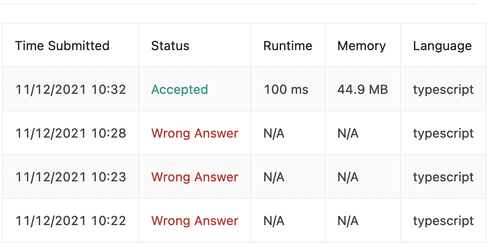

Another day, another LC easy!

And my fatal flaw reveals itself. Here's my submission history for today:



I saw this problem and had a *rough* idea of how to do it - went ahead and coded it. I must have hit submit around 2 minutes after reading the problem. Of course, it failed: I had not thought of the edge cases, or even *really* thought of a solution: I just went gung-ho on it.

Here's what the first submission looked:

```typescript
//O(n) runtime, O(1) space
function removeElements(head: ListNode | null, val: number): ListNode | null {
    if (head === null) return null

    const dummyHead = new ListNode(null, head)
    let curr = head
    let prev = dummyHead

    while (curr) {
           if (curr.val === val) {
              prev.next = curr.next
           }

        prev = curr
        curr = curr.next
    }

    return dummyHead.next
};
```

it actually just didn't work. My idea was to include a dummy head, and then if the values matched, then "skip" the current node. This meant that the first node was always included.

Then, my second flaw:

```typescript
//O(n) runtime, O(1) space
function removeElements(head: ListNode | null, val: number): ListNode | null {
    if (head === null) return null

    const dummyHead = new ListNode(null)
    let curr = head
    let prev = dummyHead

    while (curr) {
           if (curr.val === val) {
              prev.next = curr.next
           } else {
              prev.next = curr
           }

        curr = curr.next
    }

    return dummyHead.next
};
```

I submitted this one less than a minute after the previous, flustered about the previous one not working. This one didn't work either.

## Self Resolution

I resolved to stop and think about what the problem was and work it out on paper. I always read and preach that planning up front is 100% worth it in the long run, but I don't do it when I code. My long term goal and strategy should be, no matter how easy I think it is, to run through a solution on air before I even start coding.

During my Jane Street interview, the interviewers were very nice and I felt that they had *wanted* me to succeed. One of the things one of the interviewers told me after a similar period of fluster is "Lets (i.e. a polite way of saying 'you') take our fingers off the keyboard and think about what we should do next."

I was attempting to solve the problem without fully understanding it or the solution that I wanted to go into - I had hoped to be able to stumble across the solution by taking quick peeks into corners.

That problem solving strategy needs to go: I want to become the kind of person that really dissects and understands a problem before every putting pencil to paper. This problem, a competitive programming easy, made it clear that this was a solution I could have gotten on the first go, if I had just slowed down and understood the problem and my solution.

I guess this is why I'm starting this journey: To learn and grow 😄.

## Back to The competitive programming

```typescript
//O(n) runtime, O(1) space
function removeElements(head: ListNode | null, val: number): ListNode | null {
    if (head === null) return null

    const dummyHead = new ListNode(null, head)
    let curr = head
    let prev = dummyHead

    while (curr) {
           if (curr.val !== val) {
               prev.next = curr
               prev = curr
           } else {
               prev.next = null
           }

        curr = curr.next
    }

    return dummyHead.next
};
```

This was my final working solution. It's very similar to the first, but it has some extra bits that make it tick. For instance, one edge case that I realized existed is if the final element was a no-go, the previous element would still point to it because it's the *next* iteration that actually edited the link.

So, I added `else prev.next = null`, so that the link can be edited without having to have a next iteration.

Another thing here is that `prev` is set to `curr` only when `curr.val !== val`, for reasons that are trival.

### What I learned

My process needs to be 'slow down, understand the problem, understand the solution, then start coding' instead of my current problem solving which is 'read the problem once quickly and then have the test cases debug for you'.
