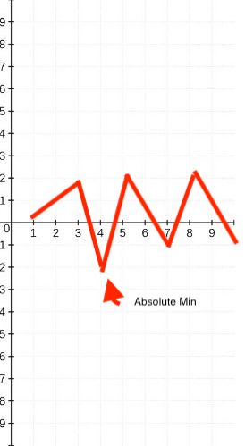
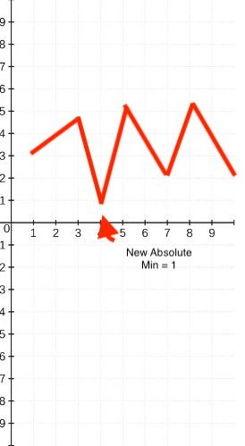

I think it's fitting that my first Leetcode session on this journey is a confidence booster.

[Here's the link the the problem](https://leetcode.com/problems/minimum-value-to-get-positive-step-by-step-sum/submissions/).

The intuition here is that we're adding the numbers in nums LTR gives us a running total graph, and we want to add the lowest constant to the starting point of the graph that the absolute minimum is equal to one. 

For example, imagine we have a running sum that looks like this, where the Y axis is the current running sum: 



because the absolute min is -2 (doesn't matter where it is, just what it is), we need to shift the whole graph up by c, where absMin + c = -1 so we end up with a graph that looks like this:



To do this, we need to find the absolute minimum:

```typescript
let lowestPoint = 0
let runningTotal = 0

for (let num of nums) {
    runningTotal += num
    
    if (runningTotal < lowestPoint) {
        lowestPoint = runningTotal
    }
}
```

and to figure out the constant that we need to add, we need to perform some transform on `lowestPoint`. If `lowestPoint` is equal to some `n` that is negative, we need to add `(n * -1)` to get it to zero, then add one to get it equal to one, where we need the lowest to be. 

My inital (incorrect) thought is that we can't just do `(lowestPoint * -1) + 1` because in the case where `lowestPoint` is greater than 0, we fail: thus, we return the following:

```typescript
return Math.max(
    0,
    (lowestPoint * -1) + 1
)
```

Ta-da! That should be a working solution. Here's the final product of the first implementation:

```typescript
// Runtime: O(n), Space: O(1)
function minStartValue(nums: number[]): number {
    let lowestPoint = 0
    let runningTotal = 0
    
    for (let num of nums) {
        runningTotal += num
        
        if (runningTotal < lowestPoint) {
            lowestPoint = runningTotal
        }
    }
    
    return Math.max(
        0,
        (lowestPoint * -1) + 1
    )
};
```

Runtime: O(n), Space: O(1)

After a little bit more thought, I thought there was no optimization left to do, and headed to the solution to see if I had an optimal solution.

I had near optimiality with one bit of redundance: the `Math.max` is actually *not* required, as by initalizing `lowestPoint` to 0, it will never be greater than 0, and therefore we can just return `-lowestPoint + 1`.

Final solution:

```typescript
// Runtime: O(n), Space: O(1)
function minStartValue(nums: number[]): number {
    let lowestPoint = 0
    let runningTotal = 0
    
    for (let num of nums) {
        runningTotal += num
        
        if (runningTotal < lowestPoint) {
            lowestPoint = runningTotal
        }
    }
    
    return -lowestPoint + 1
};
```