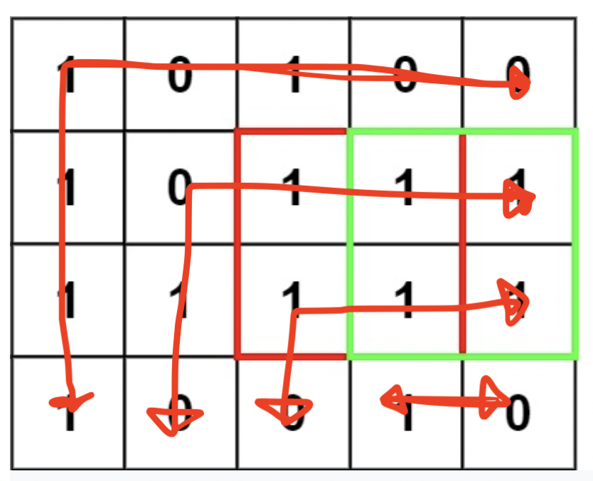

Back to work! I had finals season and I was studying, and leetcode took a hit. I only missed one day of Lettcode though - my streak dropped, but that's okay. 

Today's problem was maximal square. 

I was working through the problem, and I realized that the DP solution was a little intuitive: a square is made up of other squares, with the most atomic square at 1x1. If we have a 2x2, that's 4 1x1's, and if we have 3x3, thats 3 2x2's and so on. 

so we actually don't need to check if everything is a 1 in the square: all we have to do is, if we go from the bottom right corner, if the self, top, left, and topleft (i.e. `x, y`, `x, y - 1`, `x - 1, y`, `x - 1, y - 1`) elements are squares. If they are, we just can just add 1 to the squares size! 

My first solution was optimal in theory, but poor design. I was iterating like this: 



and had a subfunction to check the subsquares. Here's what it looks like, even though I'm not too proud, as it's rough around the edges (but optimal!):

```typescript
//O(n * m) time, O(n * m) space
function maximalSquare(matrix: string[][]): number {    
    if (!matrix.length || !matrix[0].length) {
        return 0
    }
    
    //initalize a DP array with actual numbers, so that we can do math with them
    const dp = Array.from({
        length: matrix.length
    }, (_, i) => Array.from({
        length: matrix[0].length
    }, (_, j) => parseInt(matrix[i][j])))
    

    // helper function to find the sum
    const checkFindSquareSum = ([x, y]: [number, number]): void => {
        if (dp[x][y] === 0) {
            return
        }
        
        if (dp[x - 1]?.[y - 1] > 0) { //if the top left element is greater than 1
            if (dp[x - 1][y] > 0 && dp[x][y - 1] > 0) { //and the left and right
                dp[x][y] = Math.pow(
                    Math.sqrt(
                        Math.min(dp[x - 1][y], dp[x][y - 1], dp[x - 1][y - 1])
                    ) + 1, 
                        2
                    )
            }
        }
    }
    
    
    //the crazy iteration pattern I came up with
    for (let rowIndex = 0; rowIndex < matrix.length; rowIndex++) {
        for (let horizontal = rowIndex; horizontal < matrix[0].length; horizontal++) {
            checkFindSquareSum([rowIndex, horizontal])
        }
        
        for (let vertical = 1; vertical + rowIndex < matrix.length; vertical++) {
            checkFindSquareSum([rowIndex + vertical, rowIndex])
        }
    }
    
    //refind the max
    let max = 0
    for (let i = 0; i < matrix.length; i++) {
        for (let j = 0; j < matrix[0].length; j++) {
            max = Math.max(dp[i][j], max)
        }
    }
    
    return max
};
```

This works, but can be optimized a bunch. Places of optimization:

- refinding the max is pointless; we can save that `m * n` iteration just by storing a max as we go.
- our crazy iteration pattern isn't required; if we just start at `rowIndex = 1, colIndex = 1`, we never miss a subsquare
- we technically don't need the DP array, we can just mutate the input array. I'm not gonna do this because I don't like impure fns.
- we shouldn't store the area, just the sqrt of the area - that way, we don't have to run that calculation every time.

Here's the result of these optimizations:

```typescript
//same runtime / sapce
function maximalSquare(matrix: string[][]): number {    
    if (!matrix.length || !matrix[0].length) {
        return 0
    }
    
        
    let max = 0
    
    const dp = Array.from({
        length: matrix.length
    }, (_, i) => Array.from({
        length: matrix[0].length
    }, (_, j) => {
        // only part I don't like...
        // since we're starting from matrix[i+1][j+1], if we have something like [[1, 1], [1, 0]], max
        // is still set to zero, which is incorrect, since we have 3 1's.
        const res = parseInt(matrix[i][j])
        
        if (res === 1) {
            max = res
        }
        
        return res
    }))
    
    for (let rowIndex = 1; rowIndex < matrix.length; rowIndex++) {
        for (let colIndex = 1; colIndex < matrix[0].length; colIndex++) {
            if (dp[rowIndex][colIndex] === 1) {
                dp[rowIndex][colIndex] = Math.min(
                    dp[rowIndex - 1][colIndex],
                    dp[rowIndex][colIndex - 1],
                    dp[rowIndex - 1][colIndex - 1]
                ) + 1
                
            max = Math.max(max, dp[rowIndex][colIndex])
            }
            
        }
    }
    
    return Math.pow(max, 2)
};
```

One small opimization more though! in the iteration, we're only using the results of the previous row, and the previous iterations. So, why store the whole matrix? I also looked at the solution to see if this was true, and realized that I could have my iteration start at the 1th element, but talk about the previous row and just iterate one further.

My solution looks almost exactly like the answer, so I'm not even going to format it for here :). 
