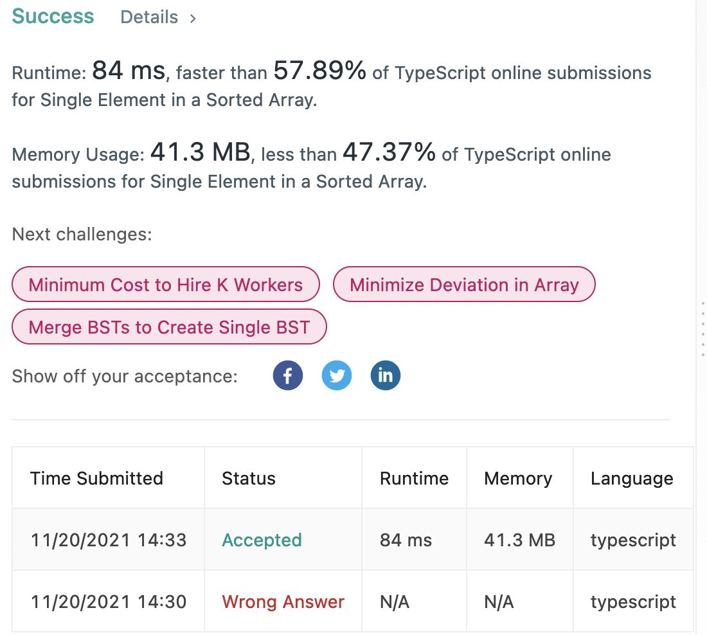

I feel really good about today - an optimal solve in less than 10 minutes, with only one minor mistake! 

I've been generally really scared of binary searches - there's some nuance in them, and I felt like I counldn't memorize the algorithm really well. I didn't realize that I didn't have to memorize it, only understand deeply the intuition behind it.



My first idea after reading the problem was that the elements aren't sequential - if they were, we could actually check if the element's index was +/-1 to the element times two, because if there was an odd before it, it would be no. I didn't fully explore that path because I quickly realized the intuition: If the first element in the pair has an odd index, then it's *after* the single element. If the first element in the pair has an even index, then it's *before* the single element.

The scary part was the binary search, but because I understood this problem well, I understood the binary search well - but skipping the binary search for now, here's my first element in the pair logic:

```typescript
let firstInPairIndex: number = null

if (nums[mid] === nums[mid - 1]) {
    firstInPairIndex = mid - 1
} else if (nums[mid] === nums[mid + 1]) {
    firstInPairIndex = mid + 1 //mistake!!
} else {
    return nums[mid]
}

if (firstInPairIndex % 2 === 0) {
    lo = mid
} else {
    hi = mid
}
```

There was only one minor mistake here, and it's that if the *next* element is the same as the current, then the next element isn't the first element in the pair, the current element is. I fixed that after a bad submission and this logic worked like a charm.

I also slightly fumbeled the midpoint algorithm: I did this: `const mid = lo + ((Math.floor(hi - lo) / 2)` which doesn't make sense intuitively, because the difference of two integers will always be an integer. Instead, I had to do the `Math.floor` on the division, like this: `const mid = lo + Math.floor((hi - lo) / 2)` - which also worked like a charm. With all the puzzle pieces in place, here is the solution:

```typescript
//O(logn) runtime, O(1) space
function singleNonDuplicate(nums: number[]): number {
    let lo = 0
    let hi = nums.length

    while (lo < hi) {
        const mid = lo + Math.floor((hi - lo) / 2)
        
        let firstInPairIndex: number = null
        
        if (nums[mid] === nums[mid - 1]) {
            firstInPairIndex = mid - 1
        } else if (nums[mid] === nums[mid + 1]) {
            firstInPairIndex = mid
        } else {
            return nums[mid]
        }
        
        if (firstInPairIndex % 2 === 0) {
            lo = mid
        } else {
            hi = mid
        }
    }
    
    return lo
};
```

This is awesome, as it's my first binary search solve. Very proud leetcoder today :) 