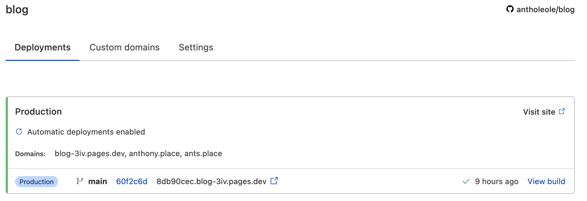
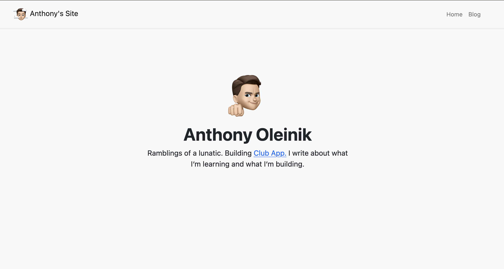
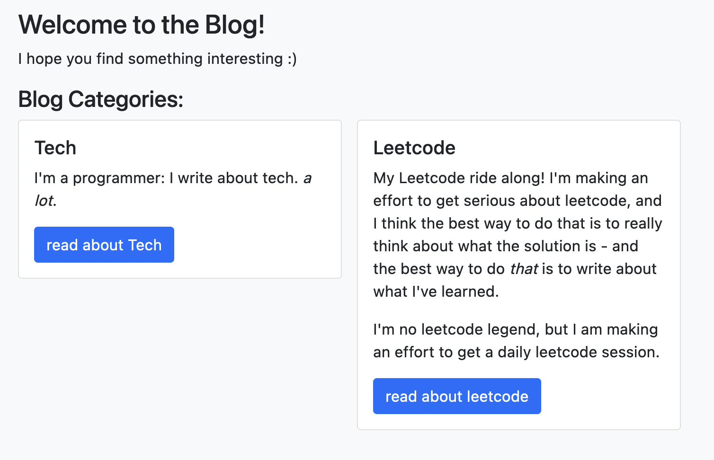

Don't get me wrong: I love Medium as a platform. It's by far the best way for a writer to get their writing noticed - publications provide a natural and helpful mechanism for content filtering, and a good way for readers to discover new writers.

In short, It's one of the best ways for a writer to reach new readers - a win for writers and readers alike.

But, as a writer who gets paid to publish on this platform, I need to treat it like a job: I *only* publish content on Medium that I'm proud of, and I feel delivers value to the reader. Whatsmore, I feel that I need to stay in my "niche": my followers follow me because they like my tech tutorials, not because they care about my thoughts on Kolmogrov complexity, or my daily competitive programming grind.

That's why I built my blog - and I built it, and deployed it, in no more than 3 hours. Here's how I did it.

Proof: [here's a link to the blog](https://ants.place/) :)

## The Journey

Everyone knows that every good side project starts with buying a domain name. I settled on `anthony.place`, but quickly realized `ants.place` (Ant is the name that my friends often call me, and it makes for a short and catchy domain name) was open, so I bought that one too. Cloudflare (Who you'll soon realize is a big player in this story) has recently launched a [domain registrar]((https://www.cloudflare.com/products/registrar/)), and it's the cheapest domains I've found anywhere else, so I went ahead and bought it on there.

Well, the domain is already on Cloudflare, so might as well use [Cloudflare Pages](https://pages.cloudflare.com/), right?

### Cloudflare Pages

Cloudflare Pages is the first big time save in this story - previously, putting up a site would take hours, because you need to hook up Github Actions or some other CI/CD to actually deploy the code you write, and push it to a server, and then make sure all your configuration (DNS records, Nginx, etc.) were working properly.

I deployed this article by typing `git add --all && git commit -m "new article" && git push`.

Cloudflare Pages instantly hooks into your Github repository, runs a build command on every push and serves a static directory. It's like magic.

You don't even need a domain for this - I easily hooked my domain up, but Cloudflare automatically gives you a pages domain that you can happily use too.

### The Framework

Okay, so I can quickly deploy and serve my website... *but there isn't a website to deploy yet*. At this stage, I had my deploy solution, my domain, and articles ready to go - but no code for my actual website!

Choosing the frontend was interesting - there's lots of frameworks that offer really great SSG (that's static site generation - for those of you who don't know, it basically just fully builds your website and all pages into static HTML, CSS, and JS files instead of letting that happen when the server serves the content.) but I had some requirements:

1. React based: I know React really well, and that's the framework I want to use - learning is great, but in this case, I just wanted an end product.

2. Out of the box supported by Cloudflare Pages: Cloudflare Pages allow you to customize your static out directory and build script, but that's about it. This wasn't a limiting factor, because Cloudflare Pages supports a ton of frameworks out of the box.

3. Popular framework: I don't want to learn a dying framework, or one that people have no idea exists. I wanted to choose something popular and with lots of online documentation.

These 3 requirements lead me directly to `Next.js`. Next is a superset of React, and supports a lot of really great things that React just doesn't yet, like static site exporting.

This was my first time diving into Next territory, but it wasn't totally new to me - it was React based, which I've worked on extensively, and there's a plethora of online documentation, to the point where every issue I had was a short Google search away.

### Coding

I'm a Typescript fanboy, so I obviously used the Typescript version of Next.js.

I had spent around 15 minutes trying to style a Navbar for the app: I had forgotten how finnicky CSS was for the rusty developer, so I quickly pivoted and moved over to Bootstrap. Bootstrap was just the push I needed, and within the next hour, I had finished the entire site:

A markdown based blog complete with images, code, and breadcrumbs.

----------

Is it feature complete? Absoultely not. No SEO optimization, no sitemap.xml, no robots.txt, no personal resume.... Just a blog. Infact, there's issues with some pages - for instance, on the blog post category page, I used some mozilla specific styling and thus, it doesn't show correctly on Chrome. This is what it's *supposed* to look like:

It's important to keep feature creep at a minimum: I had set out to build a blog. Had I choosen to add any other features like an emailing list, or user tracking, perhaps the site would be a little better - but the longer time it takes to launch an MVP, the more of a chance that you will never launch.

If I decide one morning what my blog needs is email subscriptions (doubtful), I'll take the time to add them that day. For now, I'm happy with building and deploying my website in 3 hours, and I'll happily write my daily competitive programming blog posts in a markdown file, and happily git push them to my website.

Thanks for reading!