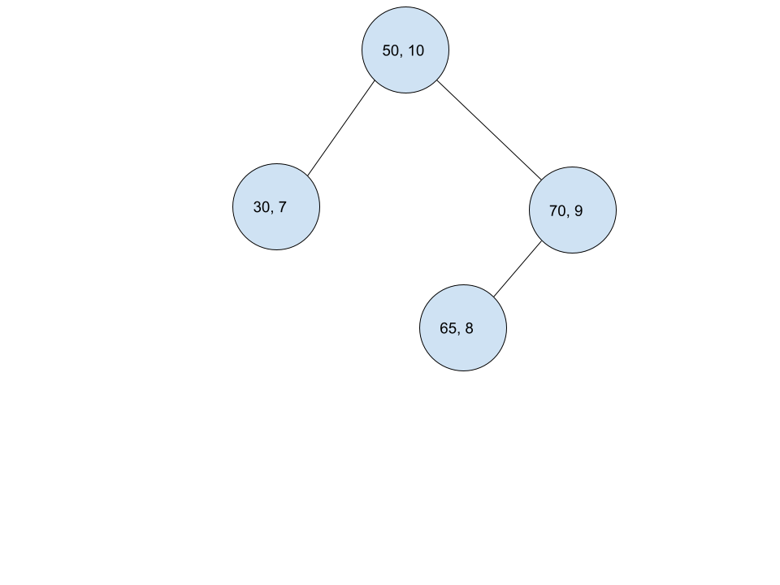
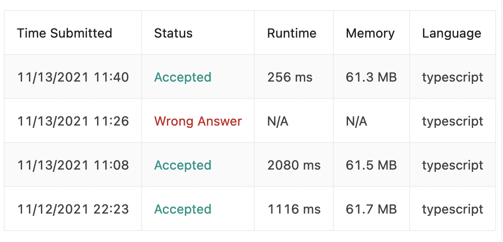

First off, here's [the link the problem](https://leetcode.com/problems/daily-temperatures/).

The trivial solution for this one is... well, trivial! All we need to do is look ahead from each element, and then stop iterating on the first element greater than the current element. This is an easy solution, so I coded it up pretty quickly:

```typescript
//O(n) space, O(nlog(n)) runtime
function dailyTemperatures(temperatures: number[]): number[] {
    const returnList = []
    
    for (let i = 0; i < temperatures.length; i++) {
        for (let j = i; j < temperatures.length; j++) {
            if (temperatures[j] > temperatures[i]) {
                returnList.push(j - i)
                break
            }
        }
        
        if (returnList[i] === undefined) {
            returnList.push(0)
        }
    }
    
    return returnList
};
```

it's worth noting that I think that space and time complexity could be a lot better here. I only had one failed submission before completing, and that's because I forgot the `break` - so the solution worked out of the box. 

The only difficult part here is knowing what to push onto the list. in this case, we're pushing j - i, or the number of spaces ahread that the biggest one is. 

I started with the intuition that we can iterate backwards to "know" the future: this would allow us to quickly check if one is greater, and where it is. It follows, then, that we need a datastructure that can store both index and value (map, set, heap out of the question) and allows for quick lookups (linked list out). The only remaning data structure, that also happens to be the one that works the best is the BST.

Unfortunately, a BST won't work, and I learned that after around half an hour of trying. Here's why. Imagine we have a array like `[?, ?, ?, ?, ?, ?, ?, 30, 65, 70, 50]`. It would generate a BST like the following:



Then, if the last question mark was `67`, we would traverse left from the root node, entirely missing the right subtree. We missed the correct vaue, which should be 70.

I really didn't appreciate the BST approach to begin with, because there's a lot of scaffolding that comes with BST's and it just "feels" like a bad answer. 

So, back to the drawing board!

I'd like to keep the backwards iteration solution, as I think that the concept is there. 

The solution I came up with the second round has a little bit of short circuting, bit it failed to pass: The intution was the following:

 - Iterator `i` iterates through temperatures backwards from the second to last element.s
 - Initalize `j` as the *next* element in the list (we can safely do this because we know the last element is 0, so we begin backwards iteration from the second to last)
 
 1. If `temperature[j] > temperature[i]`, then we can set the `returnList[i] = j - i`. That's because that's the "next" biggest element.
 2. If the first test case failed, that means `temperature[j]` is either equal to or less than `temperature[i]`. It follows that if `temperature[j]` is less than `temperature[i]` and the return value is 0, then there is no greater elements after `temperature[j]`, and therefore we are also 0.
 3. If it's not 0, that means there is a greater element than `temperature[j]` - but everything between that is less then `temperature[j]` (and therefore `temperature[i]`), so we can skip all elements between and do `j += returnList[j]`, and rerun the process.

 The code I came up for this solution is the following:

 ```typescript
 //O(1) space, O(n) runtime
 function dailyTemperatures(temperatures: number[]): number[] {
    const returnList = []
    
    //initalize return list to full 0's
    for (let i = 0; i < temperatures.length; i++) {
        returnList.push(0)
    }
    
    //iterate backwards starting from second to last element
    for (let i = temperatures.length - 1; i >= 0; i--) {
        //j needs to be pointing to the next element
        let j = i + 1
    
        //if we ever iterate off the temperatures, then we can just stop (handles "off by one").
        while (j < temperatures.length) {        
            if (temperatures[j] > temperatures[i]) {
                returnList[i] = j - i
                break
            //no greater elements case
            } else if (returnList[j] === 0) {
                break
            //skip all elements between case
            } else {
                j += returnList[j]
            }
        }
    }
    
    return returnList
};
 ```

 This feels really good! I got a pretty optimal solution all by myself after figuring out I went down the wrong path. I also only had one bad submission:

 

 and *look at that drop in runtime*. 

 I can take away from today a couple things:

 1. **Don't fall in love with a solution**: The BST felt right at first, but as I explored I realized there were a lot of cases where it didn't work. I feel like I need to try to "disprove" a solution first, before I actually get into it.
 2. **Code iteratively**: My solution didn't come all at once: it was a bunch of "ah-ha!" moments. I realized you could iterate backwards, then I realized you could prefill an array with 0's, then I realized you could "skip" elements and that if there was a 0, it signified no future greater elements.
 3. **Time / space complexity analysis**: Space required to return the solution is not in space complexity. Time complexity should be amortized. Space complexity is hard to prove in this one, but my general idea is that once you traverse a section, you *never* traverse it linearly again - hence, O(n): if you have to travel, you can skip large sections. If you travel all the way to end, you get a 0 and then you never have to travel past it again for bigger elements.